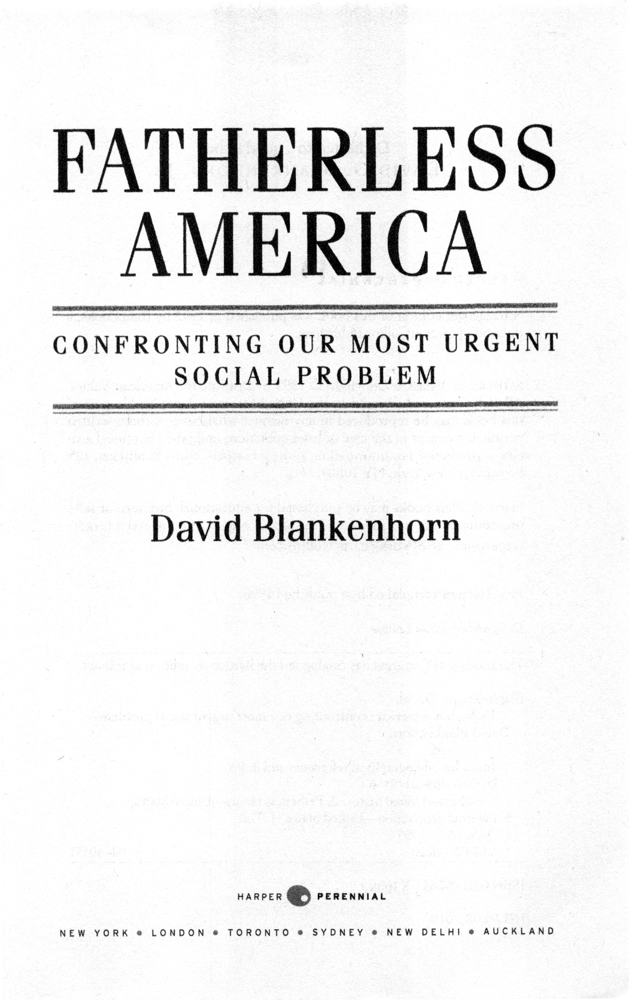
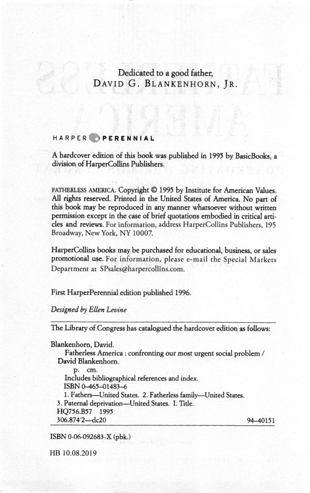
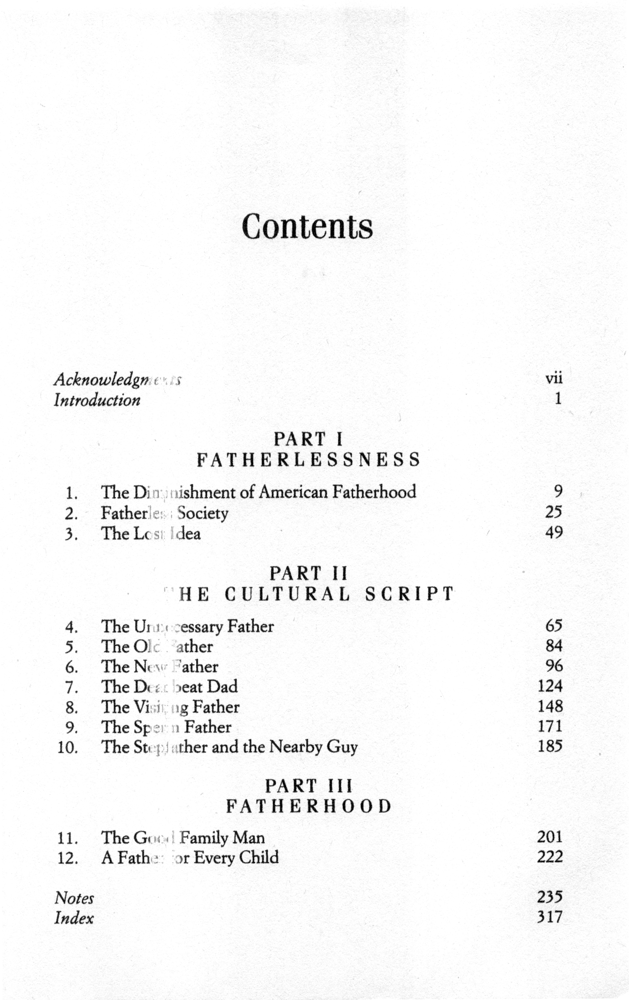

### Acknowledgments
My most important author’s debts are to my colleagues Barbara
Dafoe Whitehead and David Popenoe, who started this project
with me and made enormous contributions in the early stages of
the book, Barbara Dafoe Whitehead contributed heavily to the first three
chapters, especially her research and insights into the fatherhood debate
during World War II. David Popenoe contributed importantly to the
research material, especially in the social science and historical fields, used
in the book. To these two good friends go my deepest thanks. They do
agree with all the views expressed in this book, but the book is much
stronger as a result of our collaboration.

I am also especially grateful to Jean Bethke Elshtain, Mary Ann Glendon,
and Sylvia Ann Hewlett for their numerous valuable suggestions, for
their advice and friendship, and for their inspiring commitment to improving 
child well-being in our society.

Grace De George and Paul Hirschfield contributed many hours of
research and editorial assistance to this book. I deeply appreciate their
help. At Basic Books, Kermit Hummel and Linda Carbone guided
through this journey with great patience and much skill. Other authors
should be so lucky. For talking to me about the ideas in this book, and for
teaching me a great deal, I am particularly grateful to Charles Ballard, Don
Browning, Don Eberly, Lew Finfer, Maggie Gallagher, Norval Glenn,
David Gutmann, Heather Higgins, Wade Horn, Leon and Amy Kass, Mar
tin Kessler, Elizabeth Lurie, and Dana Mack.

This book would never have been possible without the support and
encouragement of the Institute for American Values. I am especially grate
ful to the Institute’s Board of Directors and financial supporters for mak
ing it possible for me to undertake this project.

My wife, Raina Sacks Blankenhorn, read every draft of every chapter
with the toughness of an editor, the insight and spirit of a writer, and the
generosity of a spouse. I cannot imagine this book, or much else, apart
from her. I am honored that a painting of her father, Raynond Sacks, who
died when his daughter was ten years old, is on the cover his book.

Most of what I believe about family life I first learned not from conferences or libraries
but from my parents. For this reason,when I describe in
this book the importance of committed parents, I am also describing their
importance to me.

### Indroduction
The United States is becoming an increasingly fatherless society. 
A generation ago, an American child could reasonably expect to grow up
with his or her father. Today, an American child can reasonably
expect not to. Fatherlessness is now approaching a rough parity with
fatherhood as a defining feature of American childhood.

This astonishing fact is reflected in many statistics, but here are the two
most important. Tonight, about 40 percent of American children will go to
sleep in homes in which their fathers do not live. Before they reach the age
of eighteen, more than half of our nation’s children are likely to spend at
least a significant portion of their childhoods living apart from their
fathers.* Never before in this country have so many children been voluntarily 
abandoned by their fathers. Never before have so many children
grown up without knowing what it means to have a father.

Fatherlessness is the most harmful demographic trend of this generation. 
It is the leading cause of declining child well-being in our society. It is
also the engine driving our most urgent social problems, from crime to
adolescent pregnancy to child sexual abuse to domestic violence against
women. Yet, despite its scale and social consequences, fatherlessness is a
problem that is frequently ignored or denied. Especially within our elite
discourse, it remains largely a problem with no name.

If this trend continues, fatherlessness is likely to change the shape of our
society. Consider this prediction. After the year 2000, as people bom after
1970 emerge as a large proportion of our working-age adult population,
the United States will be a nation divided into two groups, separate and
unequal. The two groups will work in the same economy, speak a common
language, and remember the same national history. But they will live fundamentally 
divergent lives. One group will receive basic benefits —psychological, 
social, economic, educational, and moral— that are denied to the
other group.

The primary fault line dividing the two groups will not be race, religion,
class, education, or gender. It will be patrimony. One group will consist of
those adults who grew up with the daily presence and provision of fathers.
The other group will consist of those who did not. By the early years of the
next century, these two groups will be roughly the same size.

Surely a crisis of this scale merits a response. At a minimum, it requires
a serious debate. Why is fatherhood declining? What can be done about
it? Can our society find ways to invigorate effective fatherhood as a norm
of male behavior? Yet, to date, the public discussion on this topic has been
remarkably weak and defeatist. There is a prevailing belief that not much
can—or even should—be done to reverse the trend.

When the crime rate jumps, politicians promise to do something about
it. When the unemployment rate rises, task forces assemble to address the
problem. As random shootings increase, public health officials worry
about the preponderance of guns. But when it comes to the mass defection
of men from family life, not much happens.

There is debate, even alarm, about specific social problems. Divorce.
Out-of-wedlock childbearing. Children growing up in poverty. Youth violence. 
Unsafe neighborhoods. Domestic violence. The weakening of
parental authority. But in these discussions, we seldom acknowledge the
underlying phenomenon that binds together these otherwise disparate
issues; the flight of males from their children’s lives. In fact, we seem to go
out of our way to avoid the connection between our most pressing social
problems and the trend of fatherlessness.

We avoid this connection because, as a society, we are changing our
minds about the role of men in family life. As a cultural idea, our inherited
understanding of fatherhood is under siege. Men in general, and fathers in
particular, are increasingly viewed as superfluous to family life: either
expendable or as part of the problem. Masculinity itself, understood as
anything other than a rejection of what it has traditionally meant to be
male, is typically treated with suspicion and even hostility in our cultural
discourse. Consequently, our society is now manifestly unable to sustain, or
find reason to believe in, fatherhood as a distinctive domain of male activity.

The core question is simple: Does every child need a father? Increasingly, 
our society’s answer is “no,” or at least “not necessarily.” Few idea
shifts in this century are as consequential as this one. At stake is nothing
less than what it means to be a man, who our children will be, and what
kind of society we will become.

This book is a criticism not simply of fatherlessness but of a culture of
fatherlessness. For, in addition to losing fathers, we are losing something
larger: our idea of fatherhood. Unlike earlier periods of father absence in
our history, we now face more than a physical loss affecting some homes.
We face a cultural loss affecting every home. For this reason, the most
important absence our society must confront is not the absence of fathers
but the absence of our belief in fathers.

In a larger sense, this book is a cultural criticism because fatherhood,
much more than motherhood, is a cultural invention. Its meaning for the
individual man is shaped less by biology than by a cultural script or
story—a societal code that guides, and at times pressures, him into certain
ways of acting and of understanding himself as a man.

Like motherhood, fatherhood is made up of both a biological and a
social dimension. Yet in societies across the world, mothers are far more
successful than fathers at fusing these two dimensions into a coherent
parental identity. Is the nursing mother playing a biological or a social
role? Is she feeding or bonding? We can hardly separate the two, so seamlessly
are they woven together.

But fatherhood is a different matter. A father makes his sole biological
contribution at the moment of conception—nine months before the infant
enters the world. Because social paternity is only indirectly linked to biological 
paternity, the connection between the two cannot be assumed. The
phrase “to father a child” usually refers only to the act of insemination, not
to the responsibility for raising a child, what fathers contribute to their
offspring after conception is largely a matter of cultural devising.

Moreover, despite their other virtues, men are not ideally suited to
responsible fatherhood. Although they certainly have the capacity for
fathering, men are inclined to sexual promiscuity and paternal waywardness.
Anthropologically, human fatherhood constitutes what might be
termed a necessary problem. It is necessary because, in all societies, child
well-being and societal success hinge largely upon a high level of paternal
investment: the willingness of adult males to devote energy and resources
to the care of their offspring. It is a problem because adult males are frequently—
indeed, increasingly—unwilling or unable to make that vital
investment.

Because fatherhood is universally problematic in human societies, cultures 
must mobilize to devise and enforce the father role for men, coaxing
and guiding them into fatherhood through a set of legal and extralegal
pressures that require them to maintain a close alliance with their children’s 
mother and to invest in their children. Because men do not volunteer 
for fatherhood as much as they are conscripted into it by the surrounding
culture, only an authoritative cultural story of fatherhood can fuse
biological and social paternity into a coherent male identity.

For exactly this reason, Margaret Mead and others have observed that
the supreme test of any civilization is whether it can socialize men by
teaching them to be fathers—creating a culture in which men acknowledge
their paternity and willingly nurture their offspring. Indeed, if we can
equate the essence of the antisocial male with violence, we can equate the
essence of the socialized male with being a good father. Thus, at the center
of our most important cultural imperative, we find the fatherhood script;
the story that describes what it ought to mean for a man to have a child.

Just as the fatherhood script advances the social goal of harnessing male
behavior to collective needs, it also reflects an individual purpose. That
purpose, in a word, is happiness. Anthropologists have long understood
that the genius of an effective culture is its capacity to reconcile individual
happiness with collective well-being. By situating individual lives within a
social narrative, culture endows private behavior with larger meaning. By
linking the self to moral purposes larger than the self, an effective culture
tells us a story in which individual fulfillment transcends selfishness, and
personal satisfaction transcends narcissism.

In this respect, our cultural script is not simply a set of imported
moralisms, exterior to the individual and designed only to compel self-sacrifice.
It is also a pathway—indeed, our only pathway—to what the
founders of the American experiment called the pursuit of happiness.

The stakes on this issue could hardly be higher. Our society's conspicuous failure
to sustain or create compelling norms of fatherhood amounts to
a social and personal disaster. Today’s story of fatherhood features one
dimensional characters, an unbelievable plot, and an unhappy ending. It
reveals in our society both a failure of collective memory and a collapse of
moral imagination. It undermines families, neglects children, causes or
aggravates our worst social problems, and makes individual adult happiness—both
male and female—harder to achieve.

Ultimately, this failure reflects nothing less than a culture gone awry: 
a culture increasingly unable to establish the boundaries, erect the signposts,
and fashion the stories that can harmonize individual happiness with collective 
well-being. In short, it reflects a culture that increasingly fails to
“enculture” individual men and women, mothers and fathers.

In personal terms, the end result of this process, the final residue from
what David Gutmann calls the "deculturation"" of paternity, is narcissism: a
me-first egotism that is hostile not only to any societal goal or larger moral
purpose but also to any save the most puerile understanding of personal
happiness. In social terms, the primary results of decultured paternity are
a decline in children's well-being and a rise in male violence, especially
against women. In a larger sense, the most significant result is our society's
steady fragmentation into atomized individuals, isolated from one another
and estranged from the aspirations and realities of common membership
in a family, a community, a nation, bound by mutual commitment and shared memory.

The main character in this book is not a real person. As befits a book
about shared narratives, he is a cultural model, or what Max Weber calls
an ideal social type—an anthropomorphized composite of cultural ideas
about the meaning of paternity, I call him the Good Family Man. As
described by one of the fathers interviewed for this book, a good family
man "puts his family first."

If this book could be distilled into one sentence, it would be this:
**A good society celebrates the ideal of the man who puts his family first.**
Because our society is now lurching in the opposite direction, I see the
Good Family Man as the principal casualty of today’s weakening father
hood script. And because I cannot imagine a good society without him, I
offer him as the protagonist in the stronger script that I believe is both 
necessary and possible.

# PART I: FATHERLESSNESS
## CHAPTER 1: The Diminishment of American Fatherhood
A Michigan high school senior, Kara Hewes, enters a crowded conference 
room to face cameras and reporters. She is about to make a
public appeal to her seventy-three-year-old father. She asks him to
admit his paternity. "I’d just like him to be a father," she says. "I want very
much to develop a relationship with him."^1^ Her biological father, identified 
through a reliable blood test, is Bruce Sundlun, World War II Air
Force captain. Harvard Law School graduate, and second-term governor
of Rhode Island.

Kara Hewes gets her wish. Shortly after the press conference in June
1993, Sundlun acknowledges his paternity and agrees to pay Kara's college
tuition. She withdraws her paternity suit. Father and daughter dine
together in the governor’s mansion, and he invites her to visit him and his
other children at his Newport estate.^2^

The governor's supporters are confident that the publicity will not damage 
his political career. After all, this is a complicated case. The thrice-divorced
governor was single at the time he fathered Kara. He had already
paid $30,000 to Kara’s mother to settle an earlier suit, and Kara had been
adopted by her stepfather, who later vanished. Another important point in
Sundlun's favor, say his supporters, is that the governor has always been
forthcoming about his personal life. “His frankness and candidness with
the people of this state deserve a great deal of respect,” says Julius
Michaelson, a friend and former Rhode Island state attorney general.^3^

As for the governor, he is reluctant to dwell on the past: "I think the
important thing is not to look back," he later tells reporters in a joint press
conference with his daughter. "We're here to look forward and try to create
a relationship. You can't wave a magic wand and have a storybook life.^4^

Governor Sundlun’s unstorybook story, though a bit more public than
most, has become increasingly common. It is a story unfolding in countless
courtrooms, lawyers' suites, and welfare offices across the nation. 
Like the Fatherlessness governor, more and more men are fathering 
children outside of marriage.
More and more men are failing to support or even acknowledge their children. 
More and more men are simply vanishing from their children's lives.

Kara Hewes’s story is also familiar. A growing number of American children 
have no relationship with their fathers. Court and school officials
report that many children do not even know what to put in the "Father’s
Name" blank on printed forms. An even larger proportion of children
have only the slightest acquaintance with their fathers. In its 1991 survey of
children in the United States, the National Commission on Children
described the spreading phenomenon of father-child relationships that
"are frequently tenuous and all too often nonexistent."^5^

Fathers are vanishing legally as well as physically. About one-third of all
childbirths in the nation now occur outside of marriage. In most of these
cases, the place for the father’s name on the birth certificate is simply left
blank. In at least two of every three cases of unwed parenthood, the father
is never legally identified.^6^ Not surprisingly, paternity suits are on the rise.

When Governor Sundlun says that we "can’t wave a magic wand and
have a storybook life," he implies that the storybooks may be unrealistic.
The governor need not worry: Even storybooks for children now reflect
his kind of fatherhood. "There are different kinds of daddies," one book
for preschoolers states, and "sometimes a Daddy goes away like yours did.
He may not sec his children at all."^7^ Another children’s book is equally
candid: "Some kids know both their mom and dad, and some kids don't."
One child in this book says: "I never met my dad, but I know that he lives
in a big city." Another says: "I’ll bet my dad is really big and strong."^8^

So Kara Hewes and Governor Sundlun are, after all, something of a
storybook story. It is one we all know. It is becoming our society's story.
We see it everywhere around us. We tell it to our children. It is the story of
an increasingly fatherless society. The moral of this new narrative is that
fathers, at bottom, are unnecessary. The action of the story centers on what
can be best understood as the fragmentation of fatherhood.

Imagine something big, made out of glass, called fatherhood. First
imagine it slowly shrinking. Then imagine it suddenly shattering into
pieces. Now look around. Try to identify the shards. Over here is marriage.
Over there is procreation. Over here, manhood. Over there, parenthood.
Here, rights. There, responsibilities. In this direction, what’s best for me.
In that direction, what's best for my child.

Off to one side, looking nervous, is an emaciated fellow we must now
call a biological father, filling out forms and agreeing to mail in childsupport
payments. Off to the other side is some guy the experts now call a
social father, wondering what to do next and whether he wants to do it. In
the middle, poking through the rubble and deciding when to leave, are
mothers and children. There is much anger and much talk of "rights."
People are phoning their lawyers. People are making excuses. People are
exclaiming at how complicated things have become.

Indeed, as fatherhood fragments, things do become complicated. Culturally, 
the story of fatherhood becomes harder to figure out. For, as we witness
the collapse of fatherhood as a social role for men, we become confused and
divided about the very nature and meaning of fatherhood.

Parenting experts question whether there is anything truly gendered
about fatherhood. Scholars win research grants to investigate whether
father absence harms children. Social workers debate whether it helps children, 
especially poor children, to press for fathers' names on birth certificates. 
Judges try to sort out tangled custody conflicts, often pitting unmarried 
biological fathers against "father figures" such as the mother's
boyfriend or even former boyfriend. Journalists write stories alternately
condemning "deadbeat dads" and sympathizing with the plight of teenage
fathers.

As an analogue to the story of Kara Hewes and Bruce Sundlun, consider
the story of Ronnell Williams, a student at Taft High School in Cincinnati.
Williams is a talented basketball player, averaging twenty-nine points per
game for his high school team. He is also an honors student, expected to
graduate in the top 10 percent of his class. His achievements are all the
more remarkable because he began with so many strikes against him.

His father was killed by his mother's boyfriend when Ronnell was three
years old. His mother was addicted to drugs. He repeatedly ran away from
home, got caught stealing, and spent time in reform school. But with the
support of a coach, his truant officer, and a concerned businessman-mentor,
Williams is able to turn his life around. By the time he reaches
his senior year, he is a model student, a school leader, and a basketball
star. College coaches come calling.

The story should end here. But it doesn't. Just before graduation,
Williams is arrested for selling crack cocaine. As he explains to the judge,
he was peddling the drug in a desperate effort to raise money for abortions
for his two pregnant girlfriends; "I felt I was too young for the responsibility 
of being a father."

In the *New York Times*, the sportswriter Ira Berkow gives this story a
happy ending. The young athlete gets a suspended sentence. He also gets a
$25,000 basketball scholarship from American University. He's outta the
hood. Berkow's piece ends in a slow fade, with Williams walking away
down a sunny street, "dribbling the ball sweedy between his long legs."^9^

As might be expected, some *New York Times* readers object. In a letter
to the editor, the Reverend Wayland Brown urges us to consider "plenty of
fine young men who are not convicted felons and who have not impregnated 
several women. Give one of them the scholarship."
Another reader asks; "What happened to the two young women who were made pregnant
by him? My guess is that they do not have such supporters as loyal
coaches, truant officers ... and mentors who recognize and encourage
potential talent and ability in them."^10^

In most respects, Ronnell Williams and Bruce Sundlun have very little
in common. They come from different sides of the tracks. One is an old,
rich, white guy with a lot of power. The other is a young, poor, black guy
without (at least yet) much power. But as fathers, these men surely have
much more in common than either of them, or most of us, would prefer to
admit. As cultural models of paternity, these men are twin brothers. They
both embody the collapse of fatherhood as a social role for men. They
both embody the trend toward a fatherless society.

Their two stories raise fundamental questions for which we as a society
have no coherent answers. What does it mean to be a father in the United
States today? What does our society require of fathers? Are some fathers
excused from these requirements? For example, are unemployed men
excused? What about minority males from disadvantaged backgrounds?
What about prominent elected officials who are candid about their personal lives?

Do we stigmatize unwed fatherhood or do we not? Do we jail deadbeat
dads or enroll them in jobs programs? How long is a father financially
responsible for his child? As long as a child needs his help? Until court-ordered
child support expires? Until the child holds a press conference?
Our society is deeply ambivalent and divided about each of these questions.
For as fatherhood disintegrates around us, we grow more confused
about just what fatherhood is. The end result is hardly surprising: What
Governor Sundlun, somewhat mistakenly, calls storybook fathers are in
increasingly short supply.