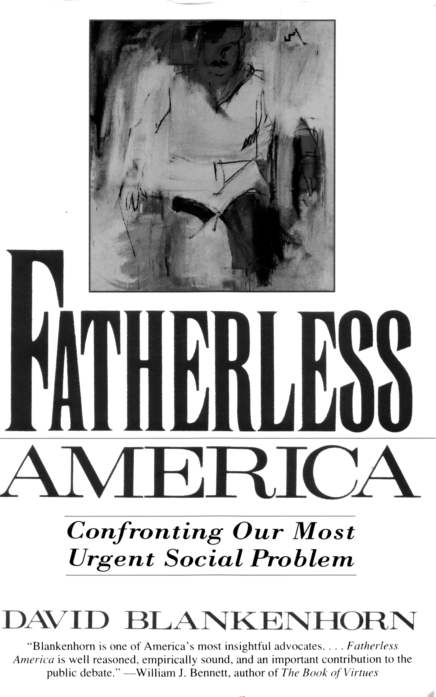
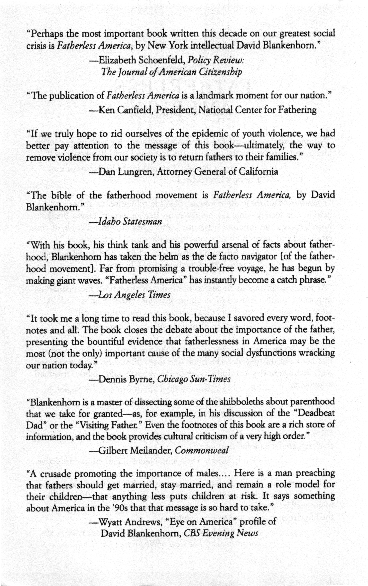

#### Contents
* [Acknowledgments](#acknowledgments)
* [Introduction](#introduction)
* [CHAPTER 1: The Diminishment of American Fatherhood](#chapter-1-the-diminishment-of-american-fatherhood)
	* [The Shrinking American Father](#the-shrinking-american-father)
	* [The Collapsing Bases of Good-Enough Fatherhood](#the-collapsing-bases-of-good-enough-fatherhood)
	* [The Rise of Volitional Fatherlessness](#the-rise-of-volitional-fatherlessness)
* [CHAPTER 2: Fatherlessness Society](#chapter-2-fatherlessness-society)
	* [Youth Violence](#youth-violence)
### Acknowledgments
My most important author's debts are to my colleagues Barbara
Dafoe Whitehead and David Popenoe, who started this project
with me and made enormous contributions in the early stages of
the book, Barbara Dafoe Whitehead contributed heavily to the first three
chapters, especially her research and insights into the fatherhood debate
during World War II. David Popenoe contributed importantly to the
research material, especially in the social science and historical fields, used
in the book. To these two good friends go my deepest thanks. They do
agree with all the views expressed in this book, but the book is much
stronger as a result of our collaboration.

I am also especially grateful to Jean Bethke Elshtain, Mary Ann Glendon,
and Sylvia Ann Hewlett for their numerous valuable suggestions, for
their advice and friendship, and for their inspiring commitment to improving 
child well-being in our society.

Grace De George and Paul Hirschfield contributed many hours of
research and editorial assistance to this book. I deeply appreciate their
help. At Basic Books, Kermit Hummel and Linda Carbone guided
through this journey with great patience and much skill. Other authors
should be so lucky. For talking to me about the ideas in this book, and for
teaching me a great deal, I am particularly grateful to Charles Ballard, Don
Browning, Don Eberly, Lew Finfer, Maggie Gallagher, Norval Glenn,
David Gutmann, Heather Higgins, Wade Horn, Leon and Amy Kass, Mar
tin Kessler, Elizabeth Lurie, and Dana Mack.

This book would never have been possible without the support and
encouragement of the Institute for American Values. I am especially grate
ful to the Institute's Board of Directors and financial supporters for mak
ing it possible for me to undertake this project.

My wife, Raina Sacks Blankenhorn, read every draft of every chapter
with the toughness of an editor, the insight and spirit of a writer, and the
generosity of a spouse. I cannot imagine this book, or much else, apart
from her. I am honored that a painting of her father, Raynond Sacks, who
died when his daughter was ten years old, is on the cover his book.

Most of what I believe about family life I first learned not from conferences or libraries
but from my parents. For this reason,when I describe in
this book the importance of committed parents, I am also describing their
importance to me.

### Introduction
The United States is becoming an increasingly fatherless society. 
A generation ago, an American child could reasonably expect to grow up
with his or her father. Today, an American child can reasonably
expect not to. Fatherlessness is now approaching a rough parity with
fatherhood as a defining feature of American childhood.

This astonishing fact is reflected in many statistics, but here are the two
most important. Tonight, about 40 percent of American children will go to
sleep in homes in which their fathers do not live. Before they reach the age
of eighteen, more than half of our nation's children are likely to spend at
least a significant portion of their childhoods living apart from their
fathers.* Never before in this country have so many children been voluntarily 
abandoned by their fathers. Never before have so many children
grown up without knowing what it means to have a father.

Fatherlessness is the most harmful demographic trend of this generation. 
It is the leading cause of declining child well-being in our society. It is
also the engine driving our most urgent social problems, from crime to
adolescent pregnancy to child sexual abuse to domestic violence against
women. Yet, despite its scale and social consequences, fatherlessness is a
problem that is frequently ignored or denied. Especially within our elite
discourse, it remains largely a problem with no name.

If this trend continues, fatherlessness is likely to change the shape of our
society. Consider this prediction. After the year 2000, as people bom after
1970 emerge as a large proportion of our working-age adult population,
the United States will be a nation divided into two groups, separate and
unequal. The two groups will work in the same economy, speak a common
language, and remember the same national history. But they will live fundamentally 
divergent lives. One group will receive basic benefits —psychological, 
social, economic, educational, and moral— that are denied to the
other group.

The primary fault line dividing the two groups will not be race, religion,
class, education, or gender. It will be patrimony. One group will consist of
those adults who grew up with the daily presence and provision of fathers.
The other group will consist of those who did not. By the early years of the
next century, these two groups will be roughly the same size.

Surely a crisis of this scale merits a response. At a minimum, it requires
a serious debate. Why is fatherhood declining? What can be done about
it? Can our society find ways to invigorate effective fatherhood as a norm
of male behavior? Yet, to date, the public discussion on this topic has been
remarkably weak and defeatist. There is a prevailing belief that not much
can—or even should—be done to reverse the trend.

When the crime rate jumps, politicians promise to do something about
it. When the unemployment rate rises, task forces assemble to address the
problem. As random shootings increase, public health officials worry
about the preponderance of guns. But when it comes to the mass defection
of men from family life, not much happens.

There is debate, even alarm, about specific social problems. Divorce.
Out-of-wedlock childbearing. Children growing up in poverty. Youth violence. 
Unsafe neighborhoods. Domestic violence. The weakening of
parental authority. But in these discussions, we seldom acknowledge the
underlying phenomenon that binds together these otherwise disparate
issues; the flight of males from their children's lives. In fact, we seem to go
out of our way to avoid the connection between our most pressing social
problems and the trend of fatherlessness.

We avoid this connection because, as a society, we are changing our
minds about the role of men in family life. As a cultural idea, our inherited
understanding of fatherhood is under siege. Men in general, and fathers in
particular, are increasingly viewed as superfluous to family life: either
expendable or as part of the problem. Masculinity itself, understood as
anything other than a rejection of what it has traditionally meant to be
male, is typically treated with suspicion and even hostility in our cultural
discourse. Consequently, our society is now manifestly unable to sustain, or
find reason to believe in, fatherhood as a distinctive domain of male activity.

The core question is simple: Does every child need a father? Increasingly, 
our society's answer is "no," or at least "not necessarily." Few idea
shifts in this century are as consequential as this one. At stake is nothing
less than what it means to be a man, who our children will be, and what
kind of society we will become.

This book is a criticism not simply of fatherlessness but of a culture of
fatherlessness. For, in addition to losing fathers, we are losing something
larger: our idea of fatherhood. Unlike earlier periods of father absence in
our history, we now face more than a physical loss affecting some homes.
We face a cultural loss affecting every home. For this reason, the most
important absence our society must confront is not the absence of fathers
but the absence of our belief in fathers.

In a larger sense, this book is a cultural criticism because fatherhood,
much more than motherhood, is a cultural invention. Its meaning for the
individual man is shaped less by biology than by a cultural script or
story—a societal code that guides, and at times pressures, him into certain
ways of acting and of understanding himself as a man.

Like motherhood, fatherhood is made up of both a biological and a
social dimension. Yet in societies across the world, mothers are far more
successful than fathers at fusing these two dimensions into a coherent
parental identity. Is the nursing mother playing a biological or a social
role? Is she feeding or bonding? We can hardly separate the two, so seamlessly
are they woven together.

But fatherhood is a different matter. A father makes his sole biological
contribution at the moment of conception—nine months before the infant
enters the world. Because social paternity is only indirectly linked to biological 
paternity, the connection between the two cannot be assumed. The
phrase "to father a child" usually refers only to the act of insemination, not
to the responsibility for raising a child, what fathers contribute to their
offspring after conception is largely a matter of cultural devising.

Moreover, despite their other virtues, men are not ideally suited to
responsible fatherhood. Although they certainly have the capacity for
fathering, men are inclined to sexual promiscuity and paternal waywardness.
Anthropologically, human fatherhood constitutes what might be
termed a necessary problem. It is necessary because, in all societies, child
well-being and societal success hinge largely upon a high level of paternal
investment: the willingness of adult males to devote energy and resources
to the care of their offspring. It is a problem because adult males are frequently—
indeed, increasingly—unwilling or unable to make that vital
investment.

Because fatherhood is universally problematic in human societies, cultures 
must mobilize to devise and enforce the father role for men, coaxing
and guiding them into fatherhood through a set of legal and extralegal
pressures that require them to maintain a close alliance with their children's 
mother and to invest in their children. Because men do not volunteer 
for fatherhood as much as they are conscripted into it by the surrounding
culture, only an authoritative cultural story of fatherhood can fuse
biological and social paternity into a coherent male identity.

For exactly this reason, Margaret Mead and others have observed that
the supreme test of any civilization is whether it can socialize men by
teaching them to be fathers—creating a culture in which men acknowledge
their paternity and willingly nurture their offspring. Indeed, if we can
equate the essence of the antisocial male with violence, we can equate the
essence of the socialized male with being a good father. Thus, at the center
of our most important cultural imperative, we find the fatherhood script;
the story that describes what it ought to mean for a man to have a child.

Just as the fatherhood script advances the social goal of harnessing male
behavior to collective needs, it also reflects an individual purpose. That
purpose, in a word, is happiness. Anthropologists have long understood
that the genius of an effective culture is its capacity to reconcile individual
happiness with collective well-being. By situating individual lives within a
social narrative, culture endows private behavior with larger meaning. By
linking the self to moral purposes larger than the self, an effective culture
tells us a story in which individual fulfillment transcends selfishness, and
personal satisfaction transcends narcissism.

In this respect, our cultural script is not simply a set of imported
moralisms, exterior to the individual and designed only to compel self-sacrifice.
It is also a pathway—indeed, our only pathway—to what the
founders of the American experiment called the pursuit of happiness.

The stakes on this issue could hardly be higher. Our society's conspicuous failure
to sustain or create compelling norms of fatherhood amounts to
a social and personal disaster. Today's story of fatherhood features one
dimensional characters, an unbelievable plot, and an unhappy ending. It
reveals in our society both a failure of collective memory and a collapse of
moral imagination. It undermines families, neglects children, causes or
aggravates our worst social problems, and makes individual adult happiness—both
male and female—harder to achieve.

Ultimately, this failure reflects nothing less than a culture gone awry: 
a culture increasingly unable to establish the boundaries, erect the signposts,
and fashion the stories that can harmonize individual happiness with collective 
well-being. In short, it reflects a culture that increasingly fails to
"enculture" individual men and women, mothers and fathers.

In personal terms, the end result of this process, the final residue from
what David Gutmann calls the "deculturation"" of paternity, is narcissism: a
me-first egotism that is hostile not only to any societal goal or larger moral
purpose but also to any save the most puerile understanding of personal
happiness. In social terms, the primary results of decultured paternity are
a decline in children's well-being and a rise in male violence, especially
against women. In a larger sense, the most significant result is our society's
steady fragmentation into atomized individuals, isolated from one another
and estranged from the aspirations and realities of common membership
in a family, a community, a nation, bound by mutual commitment and shared memory.

The main character in this book is not a real person. As befits a book
about shared narratives, he is a cultural model, or what Max Weber calls
an ideal social type—an anthropomorphized composite of cultural ideas
about the meaning of paternity, I call him the Good Family Man. As
described by one of the fathers interviewed for this book, a good family
man "puts his family first."

If this book could be distilled into one sentence, it would be this:
**A good society celebrates the ideal of the man who puts his family first.**
Because our society is now lurching in the opposite direction, I see the
Good Family Man as the principal casualty of today's weakening father
hood script. And because I cannot imagine a good society without him, I
offer him as the protagonist in the stronger script that I believe is both 
necessary and possible.

# PART I: FATHERLESSNESS
## CHAPTER 1: The Diminishment of American Fatherhood
A Michigan high school senior, Kara Hewes, enters a crowded conference 
room to face cameras and reporters. She is about to make a
public appeal to her seventy-three-year-old father. She asks him to
admit his paternity. "I'd just like him to be a father," she says. "I want very
much to develop a relationship with him."^1^ Her biological father, identified 
through a reliable blood test, is Bruce Sundlun, World War II Air
Force captain. Harvard Law School graduate, and second-term governor
of Rhode Island.

Kara Hewes gets her wish. Shortly after the press conference in June
1993, Sundlun acknowledges his paternity and agrees to pay Kara's college
tuition. She withdraws her paternity suit. Father and daughter dine
together in the governor's mansion, and he invites her to visit him and his
other children at his Newport estate.^2^

The governor's supporters are confident that the publicity will not damage 
his political career. After all, this is a complicated case. The thrice-divorced
governor was single at the time he fathered Kara. He had already
paid $30,000 to Kara's mother to settle an earlier suit, and Kara had been
adopted by her stepfather, who later vanished. Another important point in
Sundlun's favor, say his supporters, is that the governor has always been
forthcoming about his personal life. "His frankness and candidness with
the people of this state deserve a great deal of respect," says Julius
Michaelson, a friend and former Rhode Island state attorney general.^3^

As for the governor, he is reluctant to dwell on the past: "I think the
important thing is not to look back," he later tells reporters in a joint press
conference with his daughter. "We're here to look forward and try to create
a relationship. You can't wave a magic wand and have a storybook life.^4^

Governor Sundlun's unstorybook story, though a bit more public than
most, has become increasingly common. It is a story unfolding in countless
courtrooms, lawyers' suites, and welfare offices across the nation. 
Like the Fatherlessness governor, more and more men are fathering 
children outside of marriage.
More and more men are failing to support or even acknowledge their children. 
More and more men are simply vanishing from their children's lives.

Kara Hewes's story is also familiar. A growing number of American children 
have no relationship with their fathers. Court and school officials
report that many children do not even know what to put in the "Father's
Name" blank on printed forms. An even larger proportion of children
have only the slightest acquaintance with their fathers. In its 1991 survey of
children in the United States, the National Commission on Children
described the spreading phenomenon of father-child relationships that
"are frequently tenuous and all too often nonexistent."^5^

Fathers are vanishing legally as well as physically. About one-third of all
childbirths in the nation now occur outside of marriage. In most of these
cases, the place for the father's name on the birth certificate is simply left
blank. In at least two of every three cases of unwed parenthood, the father
is never legally identified.^6^ Not surprisingly, paternity suits are on the rise.

When Governor Sundlun says that we "can't wave a magic wand and
have a storybook life," he implies that the storybooks may be unrealistic.
The governor need not worry: Even storybooks for children now reflect
his kind of fatherhood. "There are different kinds of daddies," one book
for preschoolers states, and "sometimes a Daddy goes away like yours did.
He may not sec his children at all."^7^ Another children's book is equally
candid: "Some kids know both their mom and dad, and some kids don't."
One child in this book says: "I never met my dad, but I know that he lives
in a big city." Another says: "I'll bet my dad is really big and strong."^8^

So Kara Hewes and Governor Sundlun are, after all, something of a
storybook story. It is one we all know. It is becoming our society's story.
We see it everywhere around us. We tell it to our children. It is the story of
an increasingly fatherless society. The moral of this new narrative is that
fathers, at bottom, are unnecessary. The action of the story centers on what
can be best understood as the fragmentation of fatherhood.

Imagine something big, made out of glass, called fatherhood. First
imagine it slowly shrinking. Then imagine it suddenly shattering into
pieces. Now look around. Try to identify the shards. Over here is marriage.
Over there is procreation. Over here, manhood. Over there, parenthood.
Here, rights. There, responsibilities. In this direction, what's best for me.
In that direction, what's best for my child.

Off to one side, looking nervous, is an emaciated fellow we must now
call a biological father, filling out forms and agreeing to mail in childsupport
payments. Off to the other side is some guy the experts now call a
social father, wondering what to do next and whether he wants to do it. In
the middle, poking through the rubble and deciding when to leave, are
mothers and children. There is much anger and much talk of "rights."
People are phoning their lawyers. People are making excuses. People are
exclaiming at how complicated things have become.

Indeed, as fatherhood fragments, things do become complicated. Culturally, 
the story of fatherhood becomes harder to figure out. For, as we witness
the collapse of fatherhood as a social role for men, we become confused and
divided about the very nature and meaning of fatherhood.

Parenting experts question whether there is anything truly gendered
about fatherhood. Scholars win research grants to investigate whether
father absence harms children. Social workers debate whether it helps children, 
especially poor children, to press for fathers' names on birth certificates. 
Judges try to sort out tangled custody conflicts, often pitting unmarried 
biological fathers against "father figures" such as the mother's
boyfriend or even former boyfriend. Journalists write stories alternately
condemning "deadbeat dads" and sympathizing with the plight of teenage
fathers.

As an analogue to the story of Kara Hewes and Bruce Sundlun, consider
the story of Ronnell Williams, a student at Taft High School in Cincinnati.
Williams is a talented basketball player, averaging twenty-nine points per
game for his high school team. He is also an honors student, expected to
graduate in the top 10 percent of his class. His achievements are all the
more remarkable because he began with so many strikes against him.

His father was killed by his mother's boyfriend when Ronnell was three
years old. His mother was addicted to drugs. He repeatedly ran away from
home, got caught stealing, and spent time in reform school. But with the
support of a coach, his truant officer, and a concerned businessman-mentor,
Williams is able to turn his life around. By the time he reaches
his senior year, he is a model student, a school leader, and a basketball
star. College coaches come calling.

The story should end here. But it doesn't. Just before graduation,
Williams is arrested for selling crack cocaine. As he explains to the judge,
he was peddling the drug in a desperate effort to raise money for abortions
for his two pregnant girlfriends; "I felt I was too young for the responsibility 
of being a father."

In the *New York Times*, the sportswriter Ira Berkow gives this story a
happy ending. The young athlete gets a suspended sentence. He also gets a
$25,000 basketball scholarship from American University. He's outta the
hood. Berkow's piece ends in a slow fade, with Williams walking away
down a sunny street, "dribbling the ball sweedy between his long legs."^9^

As might be expected, some *New York Times* readers object. In a letter
to the editor, the Reverend Wayland Brown urges us to consider "plenty of
fine young men who are not convicted felons and who have not impregnated 
several women. Give one of them the scholarship."
Another reader asks; "What happened to the two young women who were made pregnant
by him? My guess is that they do not have such supporters as loyal
coaches, truant officers ... and mentors who recognize and encourage
potential talent and ability in them."^10^

In most respects, Ronnell Williams and Bruce Sundlun have very little
in common. They come from different sides of the tracks. One is an old,
rich, white guy with a lot of power. The other is a young, poor, black guy
without (at least yet) much power. But as fathers, these men surely have
much more in common than either of them, or most of us, would prefer to
admit. As cultural models of paternity, these men are twin brothers. They
both embody the collapse of fatherhood as a social role for men. They
both embody the trend toward a fatherless society.

Their two stories raise fundamental questions for which we as a society
have no coherent answers. What does it mean to be a father in the United
States today? What does our society require of fathers? Are some fathers
excused from these requirements? For example, are unemployed men
excused? What about minority males from disadvantaged backgrounds?
What about prominent elected officials who are candid about their personal lives?

Do we stigmatize unwed fatherhood or do we not? Do we jail deadbeat
dads or enroll them in jobs programs? How long is a father financially
responsible for his child? As long as a child needs his help? Until court-ordered
child support expires? Until the child holds a press conference?
Our society is deeply ambivalent and divided about each of these questions.
For as fatherhood disintegrates around us, we grow more confused
about just what fatherhood is. The end result is hardly surprising: What
Governor Sundlun, somewhat mistakenly, calls storybook fathers are in
increasingly short supply.

### The Shrinking American Father

Prior to fragmenting—breaking into pieces, like Humpty Dumpty-fatherhood in our society spent a long time shrinking. Historically, 
the contraction of fatherhood both preceded and precipitated its disintegration.
In this sense, today's fragmentation of fatherhood represents the end point
of a long historical process: the steady diminishment of fatherhood as a
social role for men.

Over the past two hundred years, fathers have gradually moved from
the center to the periphery of family life. As the social role for fathers has
diminished, so our cultural story of fatherhood has by now almost completely 
ceased to portray fathers as essential guarantors of child and 
societal well-being. Not to be overly gloomy, but in some respects it has been
all downhill for fathers since the Industrial Revolution.

In colonial America, fathers were seen as primary and irreplaceable
caregivers. According to both law and custom, fathers bore the ultimate
responsibility for the care and well-being of their children, especially older
children. Throughout the eighteenth century, for example, child-rearing
manuals were generally addressed to fathers, not mothers. Until the early
nineteenth century, in almost all cases of divorce, it was established practice 
to award the custody of children to fathers. Throughout this period,
fathers, not mothers, were the chief correspondents with children who
lived away from home.

More centrally, fathers largely guided the marital choices of their children and 
directly supervised the entry of children, especially sons, into the
world outside the home. Most important, fathers assumed primary responsibility 
for what was seen as the most essential parental task: the religious
and moral education of the young. As a result, societal praise or blame for
a child's outcome was customarily bestowed not (as it is today) on the
mother but on the father.11

Of course, all of this eventually changed: not marginally, but fundamentally. 
First, industrialization and the modern economy led to the physical
separation of home and work. No longer could fathers be in both places at
once. No longer, according to Alexander Mitscherlich, could children typically 
acquire skills "by watching one's father, working with him, seeing the
way he handled things, observing the degree of knowledge and skill he had
attained as well as his limitations." The nineteenth century's "progressive
fragmentation of labor, combined with mass production and complicated
administration, the separation of home from the place of work, [and] the
transition from independent producer to paid employee who uses con
sumer goods" led to "a progressive loss of substance of the father's author
ity and a diminution of his power in the family and over the family."12

The major change in family life in the nineteenth century was the steady
feminization of the domestic sphere. Accompanying this radical change
were a host of new ideas about gender identity and family life—some
focusing on childhood as a special and separate "tender years" stage of life,
others on what were believed to be the special capacities of women to care
for children and to create, in contrast to the outside world dominated by
men, a secure moral ethos for family life.

One important consequence of these new ideas was the relative decline
of patriarchy and the shift toward more companionate models of marriage
and parenthood. The historian Carl Degler, describing the increasingly
"attenuated character" of nineteenth-century patriarchy, concludes that
"the companionate marriage placed limits on the power of the husband"
and led to the "relatively democratic role of the father in the nineteenthcentury
family."13 As early as the 1830s, Alexis de Tocqueville could praise
the "influence of democracy" on fatherhood in America, even as it led to
the fact that "paternal authority, if not destroyed, is at least impaired.14

From a modem perspective, this philosophical shift, this emerging
ethos of the companionate family, is praiseworthy. Certainly our society
could not, and does not wish to, recreate for our time the model of the
agrarian patriarchal father. Regarding the cultural meaning of paternity,
however, the historical evidence is clear; Both the new economy and the
new philosophy of the nineteenth century contributed to the sharp con
traction of fatherhood as a social role.

Stephen M. Frank summarizes the impact of these basic shifts: "As
some fathers began to spend more time at work and less at home, and as
family structure shifted away from patriarchal dominance and toward
more companionate relationships, paternal requirements shrank."15
As Susan Juster and Maris Vinovskis put it: 
*The transition from the father to the mother as the primary socializer
and educator of young children was completed by the nineteenth century. 
The mother was now regarded as the "natural" caretaker of the
child, and the father's role was limited in practice to that of a supervisor
or the ultimate dispenser of discipline in the home.*16

During the nineteenth century, fathers began a long march from the
center to the periphery of domestic life. As Joseph H. Fleck observes: "A
gradual and steady shift toward a greater role for the mother, and a
decreased and indirect role for the father, is clear and unmistakable."17 As
early as the 1830s, child-rearing manuals, now more often addressed to
mothers, began to deplore the father's absence from the home.18 In cases
of family dissolution, custody of children shifted decisively from fathers to
mothers during this period.

This shift should not be exaggerated. Describing "the continued vitality
of fatherhood" in the nineteenth century, Frank's examination of the let
ters of Civil War soldiers reminds us that many fathers "continued to be
enormous presences in their children's lives," fulfilling commitments as
both providers and nurturers. "I think of you ... and wish I could be there
to send Ed to bed on time," wrote one soldier to his wife in 1863; "should
I ever reach home again I feel thankful to think I am spared on Edwin's
account as I know he will grow up a bad boy unless some father guides
him."19  Despite its steady contraction, nineteenth-century fatherhood was
almost certainly stronger than its twentieth-century successor.

Yet the overall trend of the nineteenth century is clearly toward the
shrinking of fatherhood. "Paternal neglect," warned a New England pastor 
in 1842, was causing "the ruin of many families."20By 1900, another
worried observer could describe "the suburban husband and father
"almost entirely a Sunday institution."21

Within the home, the father retained his formal status as chief executive, 
or head of the family, but had largely ceded to his wife the role of
chief child raiser, manager, and decision maker. As Fleck puts it: "The
father continued to set the official standard of morality and to be the final
arbiter of family discipline, but he did so at more of a remove than before:
He stepped in only when the mother's delegated authority failed"22

Increasingly, men looked outside the home for the meaning of their
maleness. Masculinity became less domesticated, defined less by effective
paternity and more by individual ambition and achievement.23  Fatherhood
became a thinner social role. Paternal authority declined as the fatherhood
script came to be anchored in, and restricted to, two paternal tasks: head
of the family and breadwinner.

In our own century, of course, these two roles as well have undergone
profound change. No longer conventional wisdom, each is now a fundamentally 
contested idea. Both go to the heart of today's great disagreements, 
anxieties, and conflicts over gender identity and the family. The
remarkable generational changes regarding these issues, illustrated in table
1.1, clearly reflect the erosion throughout this century of the last two
remaining anchors of the traditional fatherhood script.

|Age group| Percent who agree|
|--|--|
|18-29|27|
|30-44|28|
|45-39|47|
|60-69|63|
|70-79|75|
|80 and up|82|

**TABLE 1.1** Adult Americans who agree that "It is much better for everyone
involved if the man is the achiever outside the home and the woman
takes care of the home and family." 
<small>*Source:* National Opinion Research Center, combined data for the 1986-91.</small>

Daniel Yankelovich also confirms this steady change in American attitudes: 
*until the late 1960s, being a real man meant being a good provider for
the family. No other conception of what it means to be a real man came
even close. Concepts of sexual potency, or physical strength, or strength
of character (manliness), or even being handy around the house were relegated 
to the bottom of the list of traits associated with masculinity. By
the late 1970s, however, the definition of a real man as a good provider
had slipped from its number one spot (86 percent in 1968) to the num
ber three position, at 67 percent. It has continued to erode.*24

In sum, over the past two hundred years, fatherhood has lost, in full or
in part, each of its four traditional roles; irreplaceable caregiver, moral educator, 
head of family, and family breadwinner. As the historian Peter N.
Steams put it: "An eighteenth-century father would not recognize the distance 
contemporary men face between work and home ... or the parental
leadership granted to mothers or indeed the number of bad fathers."25

The result is that fatherhood as a social role has been radically diminished 
in three ways. First, it has become, in the most literal sense, smaller:
There are simply fewer things that remain socially defined as a father's distinctive 
work. The script has been shortened to only a few pages.

Second, fatherhood has been devalued. Within the home, fathers have
been losing authority, within the wider society, fatherhood has been losing
esteem. Many influential people in today's public debate argue that, when
all is said and done, fathers are simply not very important.

Third, and most important, fatherhood has been diminished as paternity 
has become *decultured*-denuded of any authoritative social content
or definition. A decultured paternity is a minimalist paternity. It is biology
without society. As an extreme example, consider the phenomenon of the
sperm bank: fatherhood as anonymous insemination. No definition of
fatherhood could be tinier.

A decultured paternity necessarily fractures any coherent social under
standing of fatherhood. As fewer children live with their biological fathers,
and more live with or near stepfathers, mothers' boyfriends, or other male
"role models," biological fatherhood is being separated from social father
hood. In turn, social fatherhood, once detached from any one man,
becomes more diffuse as an idea and elastic as a role-less a person than a
style of relating to children.

It is a wise child, the proverb goes, that knows its own father. To the
degree that this teaching is true, a decultured paternity brings forth fewer
wise children. Though most children certainly disfavor this trend—prefer
ring to understand "my father" as one person rather than a series of disparate
relationships—the steady disembodiment and dispersal of social
fatherhood are defining characteristics of deculturing paternity, succinctly
captured by the title of a 1993 article in the *New York Times*: "‘Who Is My
Daddy?' Can Be Answered in Different Ways."26

A decultured paternity transforms the callings of fatherhood from
what might be termed simple but mandatory to complex but optional.
To use a military metaphor, our cultural story no longer conscripts men
into a uniform fatherhood service. Instead, fathers increasingly comprise 
an all-volunteer force, small and flexible. No longer unambiguously 
responsible for a fixed number of mandatory tasks, today's decultured
fathers must largely select for themselves, from a complex menu
of lifestyle options, the meaning of their paternity. Ultimately, a decultured
paternity is incompatible with fatherhood as a defined role for men.

Finally, a decultured paternity signals the growing detachment of father
hood from wider norms of masculinity. Consider several aspects of this
phenomenon. In our elite discourse, masculinity is widely viewed as a
problem to be overcome, frequently by insisting upon "new" fathers will
ing to disavow any inherited understandings of masculinity. In popular culture, 
the traditional male fantasy of sex without responsibility—the anti
father world view of the adolescent male, as emblematized in the
philosophy of Playboy magazine, James Bond movies, and Travis McGee
novels—is an increasingly accepted cultural model in our society, less an
accusation than an assumption about male behavior. In addition, in what
the sociologist Elijah Anderson calls the "street culture" of our inner cities,
men's glorification of casual and even predatory sex, completely divorced
from responsible fatherhood, now constitutes the core of what Anderson
calls the "sex code" of young minority males.27

All three of these otherwise distinct trends are linked by an underlying
idea: the disintegrating connection between masculinity and responsible
paternity. Being male is one thing. Being a good father is another. The latter 
is no longer the pathway to proving the former. "Man" and "father"
become separate and even dissimilar cultural categories.

Consequently, as paternity is decultured, the larger meaning of masculinity 
in our society becomes unclear and divisive. A decultured father
hood thus produces a doubtful manhood. For without norms of effective
paternity to anchor masculinity, the male project itself is increasingly called
into question and even disrepute.

Many analysts of gender issues in our century have pondered Freud's
famous question: What do women want? Fewer have sought to name the
most important question, the core issue, for men. Let me take a stab.

Men, more than women, are culture-made. Fatherhood, in particular, is
what the novelist Herbert Gold calls "a metaphysical idea"28 — an imperfect 
cultural improvisation designed not to express maleness but to social
ize it. It derives less from sexual embodiment than from a social imperative:
the need to obligate men to their offspring. Consequently, ideas about
masculinity and fatherhood are inextricably rooted in social functions.

For this reason, the core question for men today is almost certainly
less about desire than about function. Or perhaps it is that men, more
so than women, cannot name their desires without affirming their 
functions-recognizing and enjoying the special work that society needs
them to do.

So the question is not, *What do men want?* but rather. *What do men do?*

**Central to that question is the fatherhood script — thus the core question is
really, *What do fathers do?* Yet here is our tragedy. Our society is unable to
answer this question.**

### The Collapsing Bases of Good-Enough Fatherhood

Structurally, the preconditions for effective fatherhood are twofold: co-residency 
with children and a parental alliance with the mother. These two
foundations do not guarantee effective fatherhood, but they do sustain the
possibility of good-enough fatherhood. Conversely, when one or both of
these enabling conditions are absent, good-enough fatherhood is not possible 
for most men.

Both of these bases of good-enough fatherhood are collapsing in our
society. The data in tables 1.2 and 1.3 are sobering. With each passing year,
fewer and fewer men are living with their children. Fewer and fewer
fathers are willing or able to sustain cooperative partnerships with the
mothers of their children.

In 1990, more than 36 percent of all children in the nation were living
apart from their fathers — more than double the rate in 1960. The trend
shows no sign of slowing down. Indeed, it seems quite probable that, as of
1994, fully 40 percent of all children in the nation did not live with their
fathers. Scholars estimate that, before they reach age eighteen, more than
half of all children in the nation will live apart from their fathers for at least
a significant portion of their childhoods. 29

|Living with |1960 |1970 |1980 |1990|
|--|--|--|--|--|
|Father and mother|		80.6| 75.1 |62.3 |57.7|
|Mother only			|7.7	|11.8	|18.0	|21.6|
|— Never married		|3.9	|9.3	|15.5	|31.5|
|— Divorced				|24.7	|29.7	|41.6	|36.9|
|— Separated			|46.8	|39.8	|31.6	|24.6|
|— Widowed				|24.7	|21.2	|11.3	|7.0 |
|Father only			|1.0	|1.8	|1.7	|3.1 |
|— Father and stepmother|0.8	|0.9	|1.1	|0.9 |
|— Mother and stepfather|5.9	|6.5	|8.4	|10.4|
|— Neither patent		|3.9	|4.1	|5.8	|4.3 |

**TABLE 1.2** Percentage of U.S. Children in Various Family Arrangements

For most of these children, the possibility of being fathered has largely
evaporated. When a man does not live with his children and does not get
along with the mother of his children, his fatherhood becomes essentially
untenable, regardless of how he feels, how hard he tries, or whether he is a
good guy. Almost by definition, he has become de-fathered.

Yet these two father-disabling phenomena have become the distinguish
ing traits of the fatherhood trend of our time. In historical terms, the spread
of these new conditions of paternity marks the essential difference between
a fatherhood that is shrinking and a fatherhood that is fragmenting.

When fatherhood is shrinking, a father is doing less, and perhaps doing
it less well, but he is still a father. His role may be diminishing, but it is still
coherent. He is still on the premises. His children see him every day. He is
still a husband and a partner to their mother. He is responsible for protecting 
and nurturing his children. He may not win any Father's Day prizeshe may not be 
a very good father at all—but he is still recognizably a father.

But when fatherhood is *fragmenting*, the identity and social definition of
the father change not in degree but in kind. The new conditions, driven by
divorce and out-of-wedlock childbearing, split the nucleus of the nuclear
family. Now the father is physically absent. When he comes "home," his
children are not there. He is not a husband. Because the parental alliance
has either ended or never begun, the mother has little reason or opportunity 
to defend or even care about his fatherhood. In the most important
areas, he is not responsible for his children.

This transmogrification means that there is no longer any coherent
structure to his fatherhood. His paternity has become disabled, cut off
from its essential supports. In sociological terms, his fatherhood has
become deinstitutionalized, or detached from socially cognizable expectations 
and goals. Consequently, the very meaning of his fatherhood
becomes fractured and disorganized. To his children and to the larger society, 
he becomes largely unrecognizable as a father.

||1960|1970|1980|1990|
|--|--|--|--|--|
|Living apart from fathers	|17.5	|22.4	|32.2	|36,3 |
|Living with father			|82.4	|77.8	|65.1	|61.7 |

**TABLE 1.3** Percentage of U.S. Children Living with Their Biological Fathers 
<small>*Tables 1.2 and 1.3 Sources:* Donald J. Hernandez, "America's Children; Resources from Family,
Govenunem, and the Economy" (New York: Russell Sage Foundation, 1993), p. 65; "Marriage,
Divorce, and Remarriage in the 1990's," U.S. Bureau of the Census, Current Population Reports,
series P-23, no. 180 (Washington, D.C.: Government Printing Office, 1992), tables M and N, pps.
11-12; "Marital Status and Living Arrangements: March 1980," U.S. Bureau of the Census, Cur
rent Population Reports, series P-20, no. 365 (Washington, D.C.: Government Printing Office,
1981), table 5, p. 31; and "Marital Status and Living Arrangements: March 1990," U.S. Bureau of
the Census, Current Population Reports, series P-20, no. 450 (Washington, D.C.; Government
Printing Office, 1991), table 6, p, 45.
*Note:* Figures for 1980 and 1990 do not add up to 100 percent due to discrepancies of approximately 2 percent between tables M and N (see Sources) regarding the number of children living
with two parents in 1980 and 1990.</small>

Indeed, it is precisely this quality of unrecognizability, often associated
with social confusion and even bizarreness, that emerges as the telltale sign
of a fatherhood that is not simply shrinking but breaking into pieces. To
illustrate this disintegration, consider several news stories from 1993.

In Texas, Judy has a baby. The father is Larry, her boyfriend. After the
birth, Judy and her husband, Randy, decide to dismiss their pending
divorce action, keep the child, and cut off all contact with Larry. Unhappy
with this turn of events, Larry initiates legal action to establish his paternity 
and win visitation rights. In deciding in favor of Larry, the Texas
Supreme Court strikes down a state law declaring that a married man is
presumed to be the father of his wife's child, and that an unmarried man
lacks paternal rights regarding the child of an intact marriage.30

In Seattle, Megan Lucas, an unmarried mother, leaves her newborn son
with her seventeen-year-old sister. After Megan legally relinquishes her
parental rights two years later, the child, by then in foster care, is scheduled 
to be adopted by two gay men who are licensed foster parents. The
mother changes her mind about the adoption and files to regain custody.
The child's father, the *New York Times** notes, "has not come forward."31

In the media, the Texas story is interpreted largely as an expansion of
the prerogatives of fatherhood. A father should be able to visit his child,
regardless of marital status. Similarly, the Seattle story is portrayed chiefly
as an example of lingering bigotry against gay parents. Both stories are
essentially about individual rights. Unwed fathers have rights. So do gay
adoptive parents. Family law should be updated to recognize these rights.
This interpretation should not surprise us. Increasingly in our national
discourse, what Mary Ann Glendon terms "rights talk" trumps most other
considerations. Yet surely the fundamental truth, the core social dynamic,
of both of these stories is the fragmentation and dispersal of fatherhood. In
one case, fatherhood is severed from, then directly opposed to, husbandhood
and marriage. In the other, the father never even makes an appear
ance. This is the trend that produces these and many other similar stories
about fathers' "rights.32

Moreover, as fatherhood fragments, so do other institutions that depend
on fatherhood. Marriage is an obvious example, but consider a less obvious one: 
adoption. What explains the current explosion of tangled legal
quarrels and sensational media stories surrounding the issue of adoption?
One frequently offered answer is that we are becoming a more litigious
and complex society. Yes, we are. But the more precise answer is that the
fracturing of adoption in our society — its loss of institutional coherence-stems 
directly from the fracturing of fatherhood.

Consider the case of Baby Pete. In Vermont, Angela Harriman puts her
newborn baby, Pete, up for adoption. She tells everyone that the father is
Marcus Stoddard, her boyfriend. Angela's estranged husband, Daniel, who
is living in Louisiana, apparently knows nothing of the pregnancy or the
adoption. But when he learns what has happened, he takes legal action to
gain custody of a child he has never seen. Blood tests eventually show that
he, not Stoddard, is the probable father. Harriman tells a journalist: "I'm
not doing this to get back at her. I just want my son.33

In the media, the Baby Pete story is widely celebrated as having a happy
ending. The adoptive parents will maintain physical custody of Pete, while
Daniel Harriman will share legal custody with the adoptive mother and
will have visitation rights. The adoptive father, described by the New York
Times as now becoming "in effect, the stepfather," declared; "Nobody lost,
and the baby won."34 The editors of the *Times* agreed. As they saw it: 
*Lawyers are already pointing to this agreement as a possible model for
future squabbles over biological parents', adoptive parents' and children's rights. 
And so it could be.... The adults in the case put their own
interests and emotions aside to do the right thing for a child. Bless
them."*35

Bless them? Let's see. A one-day-old infant is given up for adoption by a
mother who says that her boyfriend, not her estranged husband, is the
father. This turns out to be untrue. Lawyers are called in. As a result, the
mother drops out of the picture, the baby goes to adoptive parents, and
the father, winning a big victory, gets visitation rights. A model for the
future?

No, this is a model of the decomposition of marriage and fatherhood as
social institutions. More specifically, it is a consequence of the splitting
apart of social from biological fatherhood. What results is men who
impregnate women, and who at times assert paternal rights, but who find
themselves hopelessly tangled up by a rather basic question: Who is this
child's rightful father? No one can figure it out. The Baby Pete case is a
model of our tortuous struggle to redefine parenthood as we become an
increasingly fatherless society.

In this sense, the Baby Pete story has a happy ending in precisely the
same way that child-support payments and cooperative divorces constitute
happy endings. It is happy only insofar as we define happiness as our
capacity to improve our procedures for managing the decline of father
hood. As is often the case, the *New York Times*'s gushy endorsement of this
entire philosophy—"For Once, the Baby Won"—hovers precariously on
the boundary between conventional trendiness and self-parody.

In sum, a new fatherhood has emerged in our society. But what is new is
not the hands-on, nurturing "new" fatherhood so widely proclaimed and
urged in the media and by parenting experts. Instead, measured according
to demographic reach and social impact, what is truly new in our generation 
is a fatherhood that is increasingly estranged from mothers and
removed from where children live. Unlike previous fatherhood shifts in
our nation's history, these newly dominating conditions of paternity do not
simply change or even shrink fatherhood. They end it.

### The Rise of Volitional Fatherlessness

Historically, the principal cause of fatherlessness was paternal death. By
the time they turned fifteen, about 15 percent of all American children
bom in 1870 had experienced the death of their fathers. Only slightly
more than half reached age fifteen with both parents still alive.36 At the
turn of the century, middle-aged widowed men outnumbered middle-aged
divorced men by more than 20 to 1.37

But one of the great medical and social achievements of this century has
been the steady decline of early parental death. Only about 3 percent of all
children born in 1950 lost their fathers through death before reaching age
fifteen. More than 90 percent reached that age with both parents still
alive.38

Today, the principal cause of fatherlessness is paternal choice. Over the
course of this century, the declining rate of paternal death has been
matched, and rapidly surpassed, by the rising rate of paternal abandonment. 
The shift began quite early. Even for parents of children born as
early as 1910 through 1930, according to the demographer Peter Uhlenberg,
"the increase in voluntarily broken marriages greatly exceeded the
decline in marriages broken by death.39

By 1960, about 9 percent of all U.S. children lived in single-parent
homes—not much different from the 8.5 percent who lived in single
parent homes in 1900. Yet in 1900, three of every four single parents were
widowed—nearly one of every three a widowed man. Only about 5 percent
of all children in one-parent homes in 1900 lived with a parent who
was divorced or never married.40 In 1960, by contrast,
the great majority of single-parent homes, almost all headed by women,
stemmed not from the death of a parent but from divorce and out-of-wedlock childbearing.

Since 1960, even as paternal death continued to decline, rates of
paternal abandonment skyrocketed. In the 1970s, the number of mid
dle-aged divorced men surpassed the number of middle-aged widowed
men.41 By 1992, only about 5 percent of all female-headed households
with children had experienced the death of the father; about 37 percent
had experienced parental divorce; and in 36 percent of these homes, the
parents had never married.42 For the first time in our nation's history,
millions of men today are voluntarily abdicating their fatherhood.

Though paternal death and paternal abandonment are frequently
treated as sociological equivalents, these two phenomena could hardly be
more different in their impact upon children and upon the larger society.
To put it simply, death puts an end to fathers. Abandonment puts an end
to fatherhood.

Yet among social scientists who study fatherhood, the equivalency argument 
is quite popular. Alvin L. Schorr and Phyllis Moen, for example, seek
to disprove the notion that contemporary father absence is "unique and
deviant": "There have, for hundreds of years, been single-parent
families.... Early death of the father combined with an extended span of
childbearing has made the single-parent family fairly common in the twen
tieth century.43 As the historian Tamara K. Hareven put it in her 
testimony before a congressional committee concerned with family policy; "In
fact, divorce now has a similar effect on family disruption that death once
had."44

In *The Way We Never Were*, the historian Stephanie Coontz emphasizes
the same point. To Coontz, people who worry about fatherlessness today
are historically illiterate, afflicted by a mental disability called "nostalgia,"
defined by Coontz as the tendency to believe in a past that never existed.
Coontz explains: "Even though marriages today are more likely to be interrupted 
by divorce than in former times, they are much less likely to be
interrupted by death, so that about the same number of children spend
their youth in single-parent households today as at the turn of the century,
and far fewer live with neither parent.45
Leave aside the facts showing that fewer than 10 percent of all children
lived in one-parent homes in 1900, compared with 27 percent in 1992.46
Instead, focus on Coontz's larger thesis; Parental death and parental abandonment 
are social equivalents. Before, we had one. Now we have the other. Same net result.

This thesis, commonly asserted by scholars and widely repeated by journalists 
and other commentators, is a sophism. Like all sophisms, it depends
upon a superficial correctness of form to disguise an invalid assertion. The
equivalence is only formal. Where it counts, death and abandonment are
much closer to opposites.

When a father dies, a child grieves. (I have lost someone I love.) When a
father leaves, a child feels anxiety and self-blame. (What did I do wrong?
Why doesn't my father love me?) Death is final. (He won't come back.)
Abandonment is indeterminate. (What would make him come back?)

When a father dies, his fatherhood lives on, inside the head and heart of
his child. In this sense, the child is still fathered. When a father leaves, his
fatherhood leaves with him to wither away. The child is unfathered. When
a father dies, the mother typically sustains his fatherhood by keeping his
memory alive. When a father leaves, the mother typically diminishes his
fatherhood by either forgetting him or keeping her resentments alive.47

Yesterday, when a father died, our society affirmed the importance of
fatherhood by comforting and aiding his family. Today, when a father
leaves, our society disconfirms the importance of fatherhood by accepting
his departure with reasoned impartiality. Historically, we have viewed the
death of a father as one of the greatest tragedies possible in the life of a
child. Today, we increasingly view the departure of a father as one of those
things that we must simply get used to.

Death kills men but sustains fatherhood. Abandonment sustains men
but kills fatherhood. Death is more personally final, but departure is more
culturally lethal. From a societal perspective, the former is an individual
tragedy. The latter is a cultural tragedy.

The rise of volitional fatherlessness constitutes the final diminishment of
fatherhood in our time. The fact that we discuss death and abandonment
as social equivalents speaks volumes about what is happening to our idea
of fatherhood. The fact that paternal death caused such pain and social
concern, while paternal departure is now accepted with relative equanimity, 
tells us with great precision what is truly new about contemporary
fatherhood.

## CHAPTER 2: Fatherlessness Society

Fatherhood is a social role that obligates men to their biological offspring. 
For two reasons, it is society's most important role for men.
First, fatherhood, more than any other male activity, helps men to
become good men more likely to obey the law, to be good citizens, and to
think about the needs of others. Put more abstractly, fatherhood bends
maleness –in particular, male aggression– toward prosocial purposes.1
Second, fatherhood privileges children. In this respect, fatherhood is a
social invention designed to supplement maternal investment in children
with paternal investment in children.

Paternal investment enriches children in four ways. First, it provides
them with a fathers physical protection. Second, it provides them with a
father's money and other material resources. Third, and probably most
important, it provides them with what might be termed paternal cultural
transmission: a father's distinctive capacity to contribute to the identity,
character, and competence of his children. Fourth, and most obviously,
paternal investment provides children with the day-to-day nurturing —
feeding them, playing with them, telling them a story — that they want and
need from both of their parents. In virtually all human societies, children's
well-being depends decisively upon a relatively high level of paternal
investment.

Indeed, many anthropologists view the rise of fatherhood as the key to
the emergence the human family and, ultimately, of human civilization.
As Jane and Chet Lancaster put it:

*In the course of evolution, the keystone in the foundation of the human
family was the capturing of male energy into the nurturance of the
young... . The human family is a complex organizational structure for
the garnering of energy to be transformed into the production of the
next generaui 11, and its most essential feature is the collaboration of the
male and fen parent in the division of labor.*2

**In short, the key for men is to be fathers. The key for children is to have
fathers. The key for society is to create fathers. For society, the primary
results of fatherhood are right-doing males and better outcomes for children.** 
Conversely, the primary consequences of fatherlessness are rising male violence 
and declining child well-being. In the United States at the close of
the twentieth century, paternal disinvestment has become the major cause
of declining child well-being3 and the underlying source of our most
important social problems, especially those rooted in violence.

### Youth Violence

In November 1993, Joseph Chaney, Jr., made the front page of the *Wall
Street Journal*. Arrested in Miami and charged with the crime of armed
robbery, Joseph, age thirteen, was ordered by the grand jury to be
tried as an adult. Like many American cities, Miami in the 1990s has
become increasingly punitive toward children who commit violent
crimes. The spread of such crime, according to the local judge, is making
Miami "an absolutely deplorable place to live." Across the nation, judges
and legislatures are finally running out of patience with children like
Joseph — a child who has been arrested more than sixteen times since
the age of six.4

Joseph’s mother, Yvonne Jackson, is thirty-six years old, has never been
married, and has three sons, each by a different man. None of the boys
ever really had a father or knew his own father. Mario’s father is currently
in prison. Jovon’s father recently died of AIDS. Joseph’s father is married
to another woman. All three boys have been in constant trouble with the
police.

Yvonne’s older brother, Willie, is a veteran Miami police officer and the
unmarried father of several children. He says he constantly worries about
his nephews, and frequently asks his mother and his girlfriend to help
Yvonne. (Willie does not ask for help from his and Yvonne’s father, who
does not live with their mother.)

In addition to receiving occasional help from Willie, Yvonne and her
children have participated in a number of programs aimed at helping
them. Yvonne completed a drug rehabilitation program, took a parenting
course, and has regularly requested and received help from the children’s
school counselors. Joseph attended a special counseling program for troubled youth.

When Joseph Chaney, Sr., went to visit his thirteen-year-old son, awaiting 
trial in a Miami detention center, he says he hardly recognized the little
boy: “Something told me to go up to him and hug him, but I couldn’t.
Something’s telling me to back off."5

In 1994, the Carnegie Corporation devoted an entire issue of the
*Carnegie Quarterly* to the topic of “Saving Youth from Violence.” In
summarizing recent research on the sources of, and solutions for, youth violence, 
the Carnegie Corporation came up with this list of factors that contribute 
to youth violence: frustration, lack of social skills, being labeled
“dumb,” poverty, drug and alcohol abuse, physical abuse and neglect, violence 
on television and in video games, school days that are too short, the
availability of guns, the failure to use antiviolence and conflict-resolution
curricula in school classrooms and child-care centers, inadequate health
care programs, the shortage of community-based life skills training pro
grams, and the absence of effective mentoring programs for at-risk young
people.6

As something approaching panic about the problem of youth violence
erupted across the nation during 1993 and 1994 –“Teen Violence: Wild in
the Streets,” announced the cover of *Newsweek* in August 1993– numerous 
prestigious institutions and scholars emphasized the same basic themes
presented by the Carnegie Corporation. For example, the 
American Psychological Association’s Commission on Violence and Youth issued a 1993
report on *Youth and Violence*. The report attributes the rise of youth violence 
to the following factors: 
* access to guns
* involvement in gangs and mobs
* exposure to violence in the mass media
* lack of parental supervision
* physical punishment
* substance abuse
* social and inequality
* prejudice and discrimination
* and the lack of antiviolence programs and psychological services in schools and communities.7

Along with just about everyone else, the commission calls for a comprehensive, 
multiapproach solution to the problem.

But what is wrong with these lists? Surely, all these “factors” can and
do, at least indirectly, contribute to youth violence. Yet the single
obvious factor — the one, moreover, most likely to produce the other factors — 
is conspicuously absent from these reports and recommendations
and from countless others like them.

What was most absent in Joseph Chaney, Jr.’s, life? Why is this child
going to jail for an adult crime? Admittedly, Joseph faced many problems.
A mother who, by all accounts, was inattentive and ineffective. Poverty. A
lousy neighborhood, full of guns and gangs. On the other hand, he had
uncle, a police officer, who tried to “mentor” him. Hie and his family actually 
received a great deal of help, or at least attention, from various social
workers, court officers, school counselors, and community-based life skills
training programs.

At the risk of oversimplifying a complex problem, perhaps what Joseph
Chaney, Jr., needed most—and suffered most from not receiving —was
paternal guidance from Joseph Chaney, Sr. Indeed, in the story of Joseph's
childhood, there is not a single instance of responsible fatherhood. No
grandfather. An unavailable biological father. No legal or even informal
stepfather. Even Joseph’s one male “role model,” his uncle is himself an
unmarried father.

Today the city of Miami, like the nation as a whole is fed up with
Joseph and the growing number of children like him. We will put this little
boy in jail, hoping that a prison will do what no father in his life was willing 
or able to do: keep him off the streets and teach him what it means to
be a man.

In 1988, a congressional committee investigating the national surge in
youth violence heard testimony from members of youth gangs. Here is part
of an exchange between Congressman Dan Coats of Indiana and Shawn
Grant, an eighteen-year-old from Philadelphia:

In 1988, a congressional committee investigating the nsdonal surge in
youth violence heard testimony from members of youth m, ;s. Here is part
of an exchange between Congressman Dan Coats of Ii na and Shawn Grant, 
an eighteen-year-old from Philadelphia:

* MR. COATS: See, the question I’m getting at, Shawn is I'm wondering where are the fathers. 
* MR. GRANT: Say it again? 
* MR. COATS: I’m wondering where the dads are. I'm wondering why the fathers don’t rise up and say, “I’m not going to let this happen to my family. I don’t want my kid to get killed... .” 
* MR. GRANT: Well, a lot of parents, you know, kids growing up nowadays, they get a certain age, they’re bigger than their parents. They intimidate their parents.
* MR. COATS: So, just overwhelmed by them.
* MR. GRANT: Especially if they’re on drugs or they come in the house drunk. Maybe a lady have a child who’s about six feet... .
* MR. COATS: Well, what are you going to do when your son is bigger than you? He’s fifteen and comes in and says—
* MR. GRANT: See, that’s when I’m going to try to take him to the court system or something. Then he’ll be put away. 
             I think if he do a little time like I did and sit in somewhere for like— if he did a first offense, maybe just sitting 
             there for like twenty-one days or something like in a detention juvenile center for awhile and think about what you did,
             I think he’ll come around a little bit.8

In this remarkable conversation, two themes stand out Congressman
Coats begins by speaking specifically about “fathers,” but the discussion
quickly shifts to “parents.” Boys get bigger than their parents.” Teenage
boys can intimidate their “parents.” This abstract, genderless vocabulary
has become a widely accepted convention in our academic and expert discourse
on this subject, now observed even by teenagers from Philadelphia.

But it intentionally obscures the main point. Yes, many teenage boys are
bigger than their mothers. But very few are bigger than grown men, and
very few can physically intimidate grown men—especially grown men on
the premises who act like committed fathers.9

Second, Shawn Grant does not seem to have a clue about what fathers
do. (He told the committee that he used to “wonder about my father” and
resent him for “not being around me.”)10 If a son misbehaves, Shawn
Grant’s idea is to “take him to the court system or something.” Yet Grant
did not invent this idea. Indeed, on this very point, he is simply restating
the philosophy of the Miami judicial system—lock up Joseph Chaney, Jr.—
as well as the larger philosophy in our society, which is adamant about
demanding more prisons but not very adamant at all about demanding
more fathers.

In *There Are No Children Here*, Alex Kotlowitz meticulously describes
the world of Lafeyette and Pharoah Rivers, two boys living in a Chicago
public housing project in the late 1980s.11 It is a world of relentless, pitiless
violence. It is a world in which children witness far more murders than
they do weddings—and in which welfare mothers commonly purchase
funeral insurance for their small children. It is also a world largely without
responsible adult males, a world in which Kodowitz observes a twelveyear-
old boy trying to be a man without knowing how, worrying about the
safety of his younger siblings “like a father worrying about his children."12
So closely are these two themes intertwined—growing violence rooted in
growing fatherlessness—that Kotlowitz might just as appropriately have
named his study *There Are No Fathers Here*.

Yet our society remains curiously reluctant to name this problem. Much
of our national discussion of youth crime simply ignores the elephant in
the room called fatherlessness. Moreover, many analysts come quite close
to viewing all traditional norms of fatherhood not as a remedy for the
problem of youth violence but rather as a leading cause of it.
In *Boys Will Be Boys*, Myriam Miedzian seeks to identify the primary
source of “criminal and domestic violence” in the United States in what
she terms the “male mystique”—the values of toughness, dominance,
repression of empathy, and competitiveness that comprise the inherited
manhood script in our society. These historically defined male norms, she
argues, are the primary seedbeds of violent crime. In other words, modem
violence is the result of traditional masculinity. Only by fundamentally
revising the latter can we reduce the former.

She describes the father who embodies this destructive masculine mystique: 
*He does not express much emotion. He doesn’t cry. He is very concerned with 
dominance, power, being tough. His taste in movies runs to
John Wayne and Sylvester Stallone. On TV he watches violent shows
like “Miami Vice” and “Hawaii Five-O.” Whatever his actual behavior
may be, he is likely to indulge in callous sexual talk about women. He
may feel that a high level of involvement in child care is unmanly.*13

Such fathers, she concludes, “reinforce in their sons just those qualities
that serve to desensitize them and make them more prone to commit violent 
acts or condone them."14

Miedzian’s thesis is widely accepted among the experts in this field, pervading 
many of the current reports and recommendations concerning
youth violence. Yet I would like to offer a good word for this type of
father. Doubtless he is far from perfect. But there is one sin of which he is
almost certainly innocent. He is not the reason why young boys commit crimes.

In fact, exactly the opposite is more likely to be true. This type of
father—playing rough with his children, teaching his sons to be tough and
competitive, coming home every night to watch football or crime shows on
TV while seeking to repress some of his anxieties or doubts — may not
deserve the Dad of the Year Award, but as for the probability that he or his
sons will commit criminally violent acts, he is much more likely to deserve
letter of commendation from the local police department than to deserve
the charge that Miedzian levels against him.

There are exceptions, of course, but here is the rule: Boys raised by tra
ditionally masculine fathers generally do not commit crimes. Fatherless
boys commit crimes.

Both clinical studies and anthropological investigations confirm the
process through which boys seek to separate from their mothers in search
of the meaning of their maleness. In this process, the father is irreplaceable. 
He enables the son to separate from the mother. He is the gatekeeper,
guiding his son into the community of men, teaching him to name the
meaning of his embodiment, showing him on good authority than he can
be “man enough."15

In this process, the boy becomes more than the son of his mother, or
even the son of his parents. He becomes the son of his father. Later, when
the boy becomes a man, he will reunite with the world of women, the
world of his mother, through his spouse and children. In this sense, only
by becoming his father’s as well as his mother’s son can he become a good
father and husband.16